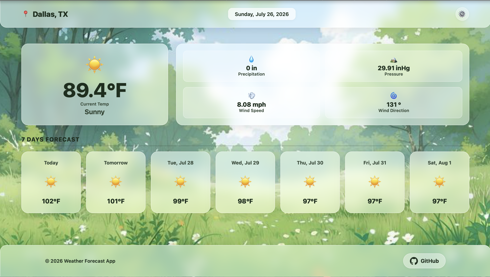
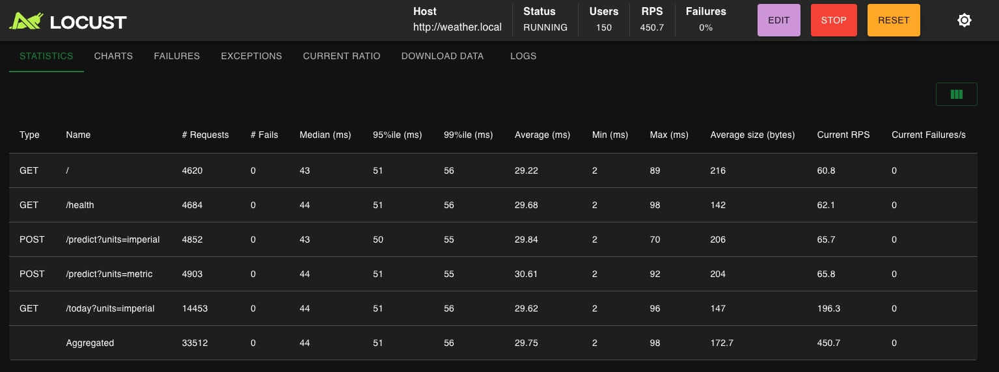
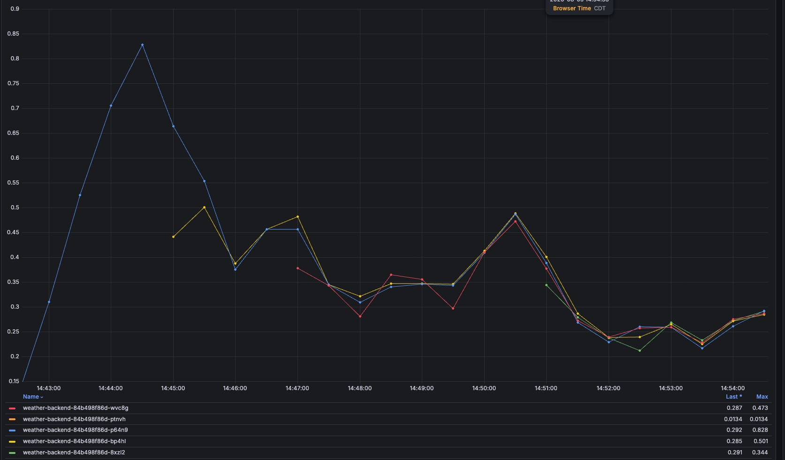

# 🌤️ WeatherForecast: Automated MLOps & K8s Architecture



A full-stack, real-time weather dashboard and 7-day Machine Learning temperature forecast for Dallas, TX. This project showcases a complete end-to-end local microservices architecture, featuring Kubernetes orchestration, Infrastructure as Code (IaC), and automated continuous training (CT) pipelines.

---

## ✨ System Architecture & Key Features

- **MLOps & Continuous Training (CT):** Fully automated GitHub Actions pipelines that fetch ground-truth telemetry daily, evaluate live model drift (Mean Absolute Error), and retrain the Scikit-Learn Lasso Regression model weekly with zero-downtime `.joblib` deployment.
- **Dual-Layer Caching Strategy & Automated Warming:** Redis integration minimizes costly external API calls and ML inference overhead. Current telemetry is cached for 1 hour, while heavy 7-day ML predictions are cached for 24 hours. A seamless cache-warming strategy guarantees 0-latency hits for the first users after data updates. Provisioned via the official Bitnami Redis Helm chart.
- **High-Performance Networking:** Custom Vite Proxy configuration bypasses macOS IPv6 DNS resolution and eliminates CORS bottlenecks, bridging the React frontend directly to the Kubernetes Ingress Controller.
- **Resilient Infrastructure:** Backend containerized and deployed on a local Minikube cluster using Helm and Terraform. Uvicorn worker counts and Redis CPU/Memory limits are precisely tuned to prevent OOM Kills and Liveness Probe timeouts during load tests. Configured with Horizontal Pod Autoscaling (HPA) to handle simulated traffic spikes dynamically.
- **Responsive UI:** Built with React & TypeScript, featuring dynamic glassmorphism styling, weather icons, and instant client-side unit conversions (°C ⇄ °F, km/h ⇄ mph).

---

## 🤖 CI/CD & MLOps Pipelines (GitHub Actions)

This project implements a fully automated Continuous Training (CT) and data ingestion architecture. To ensure system stability, every pipeline includes an automated **`pytest` safety gate** that prevents code execution or commits if the unit tests fail.

- **Hourly Telemetry Fetch (`hourly_fetch.yml`):** Runs every hour to fetch the latest weather observations, updates the local CSV dataset, and strategically evicts the 1-hour Redis telemetry cache. It then automatically runs a cache-warming script against the production Cloud Redis to pre-compute and store the new data.
- **Daily Ground Truth Evaluation (`daily_pipeline.yml`):** Runs every night at midnight UTC. It fetches the daily maximum temperature, compares it against the model's prediction from the previous day, logs the Mean Absolute Error (MAE) for drift monitoring, and evicts the 24-hour prediction cache. It also executes the cache-warming sequence to pre-compute the next 7 days of predictions.
- **Weekly Model Retraining (`weekly_retrain.yml`):** Runs every Sunday. It automatically re-runs the feature engineering pipeline on the newly expanded dataset, retrains the Scikit-Learn Lasso model, and commits the updated `.joblib` model back to the repository with zero downtime.

---

## 🏗️ Tech Stack

### Frontend

- **Core:** React, TypeScript, Vite
- **Styling:** Tailwind CSS / Custom CSS
- **State/Routing:** React Hooks

### Backend & ML

- **Core:** Python, FastAPI, Uvicorn
- **Data Processing:** Pandas, NumPy
- **Machine Learning:** Scikit-Learn (Lasso Regression)
- **Caching:** Redis / FakeRedis (Local Fallback)
- **Package Management:** `uv`

### DevOps & Infrastructure

- **Containerization:** Docker
- **Orchestration:** Kubernetes (Minikube), Helm Charts, Ingress-Nginx
- **Infrastructure as Code (IaC):** Terraform
- **CI/CD:** GitHub Actions (Cron triggers, automated commits)
- **Testing & Monitoring:** Locust, Pytest, Prometheus, Grafana

---

## 📂 Project Structure

```bash
WeatherForecast/
├── .github/workflows/          # Automated MLOps cron jobs (Hourly, Daily, Weekly)
├── backend/                    # Python FastAPI & ML Pipeline
│   ├── data/                   # Raw CSVs, JSONL logs, and Grafana dashboards
│   ├── models/                 # Serialized ML models (.joblib)
│   ├── src/                    # FastAPI application and ML source code
│   │   ├── main.py             # FastAPI routing and middleware
│   │   ├── pipeline.py         # Telemetry fetching and ground-truth evaluation
│   │   ├── preprocessing.py    # Feature engineering for ML
│   │   ├── schemas.py          # Pydantic response models
│   │   └── train.py            # Model retraining script
│   │   └── warm_cache.py       # Cache-warm script
│   ├── terraform/              # IaC to provision Kubernetes resources
│   ├── weather-chart/          # Helm chart for Kubernetes deployment
│   ├── Dockerfile              # Backend container build instructions
│   ├── locustfile.py           # Load testing configuration
│   ├── Makefile                # Automation commands for local setup
│   └── uv.lock                 # Strict dependency locking via uv
└── frontend/                   # React + TypeScript Web App
    ├── public/                 # Static assets
    ├── src/
    │   ├── components/         # Modular React components
    │   └── App.tsx             # Root application component
    ├── package.json            # Node dependencies
    └── vite.config.ts          # Vite proxy and bundler configuration
```

---

## 💻 Local Development Setup

This project is designed to be run entirely locally. The backend utilizes a `Makefile` to automate the complex orchestration of Docker, Minikube, and Terraform.

### Prerequisites

- [Docker Desktop](https://www.docker.com/products/docker-desktop/) or OrbStack
- [Minikube](https://minikube.sigs.k8s.io/docs/start/) & `kubectl`
- [Terraform](https://developer.hashicorp.com/terraform/downloads)
- [uv](https://github.com/astral-sh/uv) (Python package manager)
- [Node.js](https://nodejs.org/) & `npm`

### 1. Boot up the Backend (Kubernetes / API)

Navigate to the backend directory and use the Makefile to provision the infrastructure automatically.

```bash
cd backend

# Start Minikube, build the Docker image locally, and install testing dependencies
make setup

# Provision the Kubernetes resources (Helm & Prometheus) via Terraform
make deploy

# Open the network tunnel to expose the local Ingress (requires sudo password)
# NOTE: Leave this terminal window running!
make tunnel

# (Optional) Pre-compute and inject predictions into the local Redis cache
make warm
```

### 1.5. Configure Local DNS

To access the services through their Ingress hostnames locally, you must map them to localhost in your machine's hosts file.

```bash
sudo sh -c 'echo "127.0.0.1 weather.local grafana.local" >> /etc/hosts'
```

- **Grafana Dashboard:** Navigate to `http://grafana.local` (Username: `admin`).
  To retrieve your automatically generated Grafana password, run the following command in your terminal:
```bash
kubectl get secret -n monitoring prometheus-grafana -o go-template='{{index .data "admin-password" | base64decode}}{{"\n"}}'
```
- **Weather API:** Navigate to `http://weather.local/health`

### 2. Start the Frontend (React UI)

Open a **new** terminal window, navigate to the frontend directory, and start the Vite development server. The `vite.config.ts` is configured to proxy API requests to the Kubernetes Ingress automatically.

```bash
cd frontend

# Install Node dependencies
npm install

# Start the frontend dev server
npm run dev
```

_The Web UI is now accessible at `http://localhost:5173` (or the port Vite provides)._

### 3. Optional: Run Load Tests

To verify Horizontal Pod Autoscaling (HPA) and test the backend's resilience, you can trigger a local swarm test using Locust.

```bash
cd backend
make test
```

_Navigate to `http://localhost:8089` in your browser to start the swarm and monitor response times._

### Performance and Autoscaling

**Locust Load Testing Results**
During a simulated traffic spike with Locust (150 peak concurrent users, spawn rate 5 users/sec), the system effectively managed the load.


**Horizontal Pod Autoscaler (HPA) in Action**
To handle this traffic spike, the Horizontal Pod Autoscaler (HPA) automatically provisioned additional replica pods to maintain service availability and reduce latency.


**Important Metrics for CI/CD Autoscale:**
To ensure responsive and efficient autoscaling in a CI/CD pipeline, the following metrics are configured and monitored:
- **CPU & Memory Utilization:** The HPA is configured to trigger a scale-up when CPU utilization reaches **70%**. Pods are provisioned with **600m CPU / 256Mi Memory** requests and hard limits at **1250m CPU / 1024Mi Memory**.
- **Request Latency (Response Time):** During the load test (150 peak users, 5 users/sec spawn rate), autoscaling ensures latency remains within acceptable thresholds even under heavy load.
- **Request Rate (RPS):** The Locust test generated continuous traffic, with users making requests every 0.1 to 0.5 seconds across 5 API endpoints to validate scaling under high RPS.
- **Error Rates (5xx / 4xx):** The HPA provisions enough replicas to ensure the error rate remains at 0% during peak traffic spikes.
- **Pod Readiness/Startup Time:** Uvicorn worker counts and Redis resource limits (500m CPU / 512Mi Memory) are precisely tuned to prevent Liveness Probe timeouts and OOM Kills during rapid scale-up.

### 4. Teardown

When you are finished developing, gracefully destroy the infrastructure to free up your system's RAM.

```bash
cd backend
make clean
```
