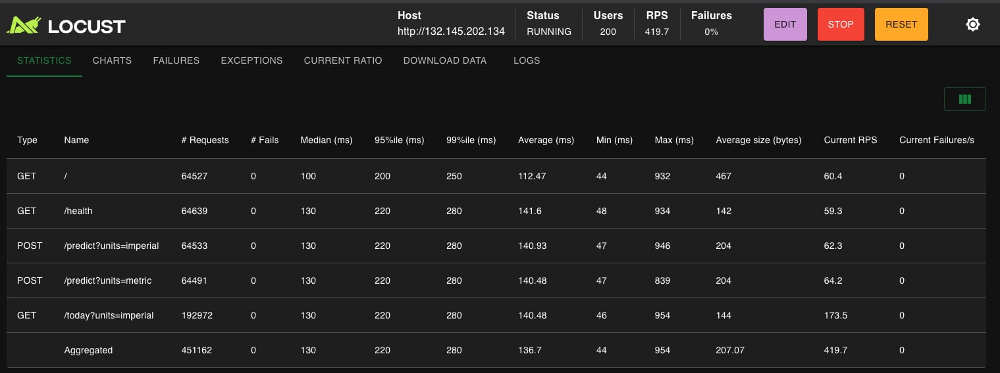
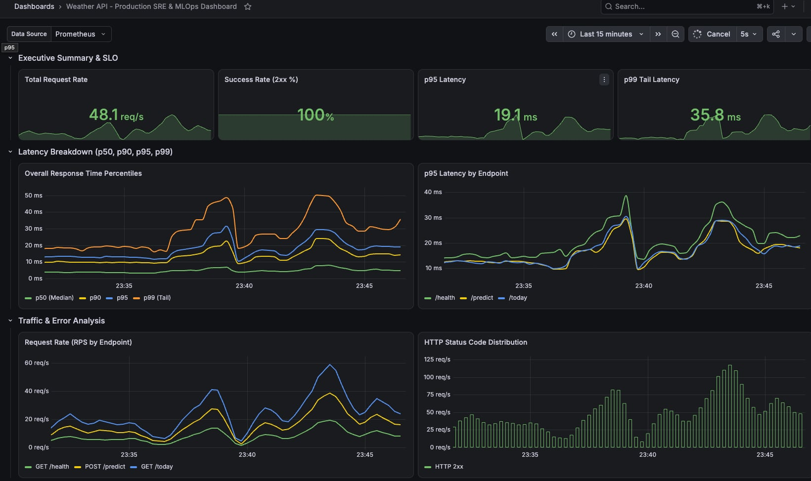

# 🌤️ WeatherForecast: Automated MLOps & Observability Architecture


A high-performance, full-stack weather dashboard and 7-day Machine Learning temperature forecasting platform for Dallas, TX. This project demonstrates an end-to-end production MLOps & cloud-native infrastructure featuring automated Continuous Training (CT) pipelines, Redis telemetry caching, multi-worker FastAPI concurrency, Kubernetes orchestration on Oracle Cloud, and full-stack observability with Prometheus and Grafana.

> 🌐 **Live Production Website:** [https://dallas-weather.com](https://dallas-weather.com) (Automated SSL/TLS via Let's Encrypt)

---

## ✨ System Architecture & Key Features

- **MLOps & Continuous Training (CT):** Automated GitHub Actions pipelines that fetch real-world weather observations daily, evaluate ground-truth model drift (Mean Absolute Error), and retrain the Scikit-Learn Lasso Regression model weekly with automated versioning.
- **Production Kubernetes (K3s) on Cloud:** Deployed on an enterprise-grade Oracle Cloud ARM64 Ampere VM running K3s, orchestrating 7 microservice pods across 2 replicas for high availability and self-healing.
- **Automated SSL/TLS & Custom Domain:** Live under `dallas-weather.com` and `www.dallas-weather.com` using **cert-manager** and Let's Encrypt production ACME HTTP-01 challenges with automated 60-day certificate renewals.
- **Defense-in-Depth Security:** Strict network boundary isolation where internal services (Redis, Prometheus, Grafana) are sequestered inside a private Kubernetes `ClusterIP` network, dropping all direct internet traffic.
- **Sub-Millisecond In-Memory Caching:** Redis caching strategy that eliminates redundant external API calls and heavy Pandas feature engineering. Live telemetry is cached for 1 hour, and 7-day ML forecasts are cached with a 24-hour TTL (`CACHE_TTL_PREDICT = 86400`).
- **High-Resolution Observability Stack:** Prometheus and Grafana integration via `prometheus-fastapi-instrumentator` with custom sub-millisecond histogram buckets (`1ms` to `1s+`), providing true p50, p90, p95, and p99 latency monitoring in real time.
- **High-Throughput Concurrency:** Uvicorn configured with 4 asynchronous worker processes (`--workers 4`), handling 300+ RPS under heavy load with zero dropped connections.
- **Responsive React Frontend:** Built with React 19, TypeScript, and Vite, featuring dynamic glassmorphism styling, animated weather visuals, and instant client-side unit toggling (°C ⇄ °F, km/h ⇄ mph, hPa ⇄ inHg).

---

## 🤖 CI/CD & MLOps Pipelines (GitHub Actions)

Every automated pipeline runs with automated **`pytest` safety gates** to guarantee code correctness before committing updates:

- **Daily Pipeline & Ground Truth Evaluation (`daily_pipeline.yml`):** Runs every night at 00:00 CDT (05:00 UTC). It fetches the previous day's verified temperature observations from Open-Meteo, calculates the Mean Absolute Error (MAE) against previous forecasts for drift tracking, and automatically commits updated datasets to the repository. Runs against a transient GitHub Actions Redis service container.
- **Weekly Model Retraining (`weekly_retrain.yml`):** Runs every Sunday at 00:30 CDT (05:30 UTC). Automatically runs feature engineering over the expanded historical dataset, retrains the Scikit-Learn multi-output Lasso regression pipeline, and commits the serialized `.joblib` model artifact back to the repository with zero downtime.

---

## 🏛️ Production Infrastructure & Engineering Design (K3s on Oracle Cloud)

### Architecture Highlights

```mermaid
graph TD
    User["🌐 Internet Visitors"]
    DNS["DNS: dallas-weather.com (A Record)"]
    Firewall["OCI Network Firewall (Port 80, 443, 22 Only)"]
    Traefik["Traefik Ingress Controller (K3s)"]
    CertMgr["cert-manager (Let's Encrypt TLS Auto-Renewal)"]
    
    subgraph K8s["Kubernetes Cluster (Namespace: weather)"]
        Frontend["Frontend Pods (2x Nginx + React 19)"]
        Backend["Backend Pods (2x FastAPI + ML Lasso)"]
        Redis["Redis Cache (ClusterIP: 6379 - Private)"]
        Prom["Prometheus (ClusterIP: 9090 - Private)"]
        Grafana["Grafana (ClusterIP: 3000 - Private)"]
    end

    User --> DNS --> Firewall --> Traefik
    CertMgr <--> Traefik
    Traefik -->|/ (HTML/JS)| Frontend
    Traefik -->|/today, /predict, /health, /metrics| Backend
    Backend --> Redis
    Backend -.->|Scrapes /metrics| Prom
    Prom --> Grafana
```

### Why This Architecture? (Engineering Rationale)

1. **True Cloud-Native Orchestration at Zero Cloud Cost ($0 / Month):**
   Deploying on managed Kubernetes offerings (AWS EKS, GCP GKE, Azure AKS) incurs monthly control plane fees (~$73/mo each) plus compute charges. Oracle Cloud Infrastructure (OCI) offers an **Always Free Tier** providing **4 Ampere A1 ARM64 OCPUs and 24 GB RAM**, alongside 200 GB of block storage and 10 TB/month outbound bandwidth.
2. **K3s vs. Standard Kubernetes (K8s/OKE):**
   Standard Kubernetes control plane components (etcd, kube-apiserver, kube-controller-manager, kube-scheduler, kube-proxy, CoreDNS) consume substantial CPU and 2–4 GB RAM just idling. **K3s** (packaged by Rancher/SUSE) combines all components into a single lightweight binary (<100 MB memory footprint) while maintaining 100% CNCF-certified Kubernetes API compatibility. This leaves **22+ GB of free RAM** exclusively for application workloads, Redis in-memory caches, and Prometheus time-series metrics.
3. **Automated Infrastructure as Code (IaC):**
   The entire cloud environment (Virtual Cloud Network, subnets, internet gateway, security firewall lists, and compute instance) is declared in **Terraform** (`terraform/`). A cloud-init bootstrapper automatically disables OS-level iptables blocks and initializes the K3s cluster with remote TLS SAN binding in one command.
4. **Declarative Kubernetes Architecture (`k8s/`):**
   - **Frontend (`frontend.yaml`):** Multi-stage Docker build (Node.js compile -> Nginx Alpine reverse proxy) delivering static assets and forwarding API requests with 2 replicas.
   - **Backend (`backend.yaml`):** 2-replica FastAPI deployment with Prometheus metrics endpoint scraping, rolling update zero-downtime policy, and automated liveness/readiness health checks.
   - **Caching (`redis.yaml`):** In-cluster Redis with AOF persistence, isolated behind private `ClusterIP`.
   - **Ingress & TLS (`ingress.yaml` & `cluster-issuer.yaml`):** Traefik Ingress with automated TLS termination for `dallas-weather.com` and `www.dallas-weather.com` powered by `cert-manager`.
   - **Monitoring (`monitoring.yaml`):** Integrated Prometheus and Grafana instances collecting cluster and application telemetry.

---

## 🏗️ Tech Stack

### Frontend
- **Framework:** React 19, TypeScript, Vite
- **Styling:** Vanilla CSS (Glassmorphism design system)
- **State & Networking:** React Hooks, Vite HTTP Proxy / Nginx Alpine Reverse Proxy

### Backend & Machine Learning
- **API Framework:** Python 3.11/3.13, FastAPI, Uvicorn (Multi-Worker)
- **Data Science & ML:** Pandas, NumPy, Scikit-Learn (Lasso Multi-Output Regressor)
- **Caching Layer:** Redis 7 (Alpine) with `fakeredis` local fallback
- **Package Management:** `uv` (Fast Python package resolver)

### Cloud, DevOps & Observability
- **Cloud Infrastructure:** Oracle Cloud Infrastructure (OCI) Always-Free Ampere A1 (4 OCPUs, 24 GB RAM)
- **Container Orchestration:** Kubernetes (K3s), Docker, GitHub Container Registry (GHCR)
- **Ingress & Security:** Traefik Ingress, `cert-manager` (Let's Encrypt ACME SSL/TLS), OCI VCN Security Lists
- **Infrastructure as Code:** Terraform
- **Metrics Collection:** Prometheus (`prom/prometheus:latest`)
- **Telemetry Dashboards:** Grafana (`grafana/grafana:latest`)
- **Load Testing:** Locust
- **CI/CD:** GitHub Actions (Service containers, continuous training, pytest gates)

---

## 📂 Project Structure

```bash
WeatherForecast/
├── .github/workflows/          # Automated MLOps cron jobs
│   ├── daily_pipeline.yml      # Daily data ingestion & MAE evaluation
│   └── weekly_retrain.yml      # Weekly automated model retraining
├── assets/                     # UI screenshots and performance benchmark graphs
├── backend/                    # Python FastAPI & ML Service
│   ├── data/                   # Historical observations & evaluation logs
│   │   ├── meteostat_export.csv # 3-year sliding historical dataset
│   │   ├── predictions_log.jsonl # Historical model predictions log
│   │   └── evaluations_log.jsonl # Ground-truth daily error tracking
│   ├── models/                 # Serialized ML model artifacts (.joblib)
│   ├── src/                    # Backend application source code
│   │   ├── config.py           # Centralized configuration & Redis TTLs
│   │   ├── main.py             # FastAPI routes, Prometheus instrumentation & health checks
│   │   ├── pipeline.py         # Data ingestion, Open-Meteo sync & MAE evaluation
│   │   ├── preprocessing.py    # Feature engineering (rolling means, lags)
│   │   ├── schemas.py          # Pydantic response models
│   │   ├── train.py            # Scikit-Learn Lasso training script
│   │   └── warm_cache.py       # Cache pre-warming utility script
│   ├── tests/                  # Automated pytest test suite
│   │   ├── test_api.py         # Endpoint and Redis integration tests
│   │   └── test_preprocessing.py # Feature engineering unit tests
│   ├── Dockerfile              # Production multi-worker backend container
│   ├── docker-compose.yml      # Multi-container orchestration (API, Redis, Prom, Grafana)
│   ├── grafana_dashboard.json  # Pre-configured Grafana monitoring dashboard
│   ├── locustfile.py           # Locust load testing scenario
│   ├── Makefile                # Unified developer CLI for stack management
│   ├── prometheus.yml          # Prometheus scrape configuration
│   ├── pyproject.toml          # Python package specification
│   └── uv.lock                 # Strict dependency locking via uv
├── frontend/                   # React + TypeScript Web Application
│   ├── src/
│   │   ├── components/         # Modular UI components (Current, Forecast, Details)
│   │   ├── types/              # TypeScript weather domain interfaces
│   │   ├── utils/              # Unit conversion & weather visual helpers
│   │   └── App.tsx             # Root React application
│   ├── Dockerfile              # Production multi-stage Nginx build
│   ├── nginx.conf              # Production Nginx reverse proxy configuration
│   ├── package.json            # Node.js dependencies
│   └── vite.config.ts          # Vite configuration & backend proxy
├── k8s/                        # Declarative Kubernetes Manifests (K3s)
│   ├── namespace.yaml          # Isolated 'weather' namespace
│   ├── backend.yaml            # 2-replica FastAPI deployment & service
│   ├── frontend.yaml           # 2-replica Nginx/React deployment & service
│   ├── redis.yaml              # Redis caching deployment & ClusterIP service
│   ├── ingress.yaml            # Traefik ingress routing for dallas-weather.com
│   ├── cluster-issuer.yaml     # Let's Encrypt production SSL ClusterIssuer
│   └── monitoring.yaml         # Prometheus & Grafana services & deployments
└── terraform/                  # Infrastructure as Code (OCI Provisioning)
    ├── main.tf                 # Compute instance, VCN, subnet & firewall rules
    ├── variables.tf            # Configurable OCI variables
    ├── outputs.tf              # Public IP and connection outputs
    ├── provider.tf             # OCI Terraform provider definition
    └── terraform.tfvars.example # Sanitized template for cloud credentials
```

---

## 💻 Local Development Setup

The backend utilizes a clean `Makefile` to manage the lifecycle of all Docker containers, caching, and testing tools.

### Prerequisites

- [Docker Desktop](https://www.docker.com/products/docker-desktop/) or OrbStack
- [uv](https://github.com/astral-sh/uv) (Python package manager)
- [Node.js](https://nodejs.org/) (v18+) & `npm`

---

### 1. Start the Backend Stack (Docker Compose)

Navigate to the `backend/` directory and spin up the complete containerized environment (FastAPI, Redis, Prometheus, and Grafana):

```bash
cd backend

# Build and start all 4 services in the background
make up

# (Optional) Pre-warm the Redis cache for instant first-hit responses
make warm
```

Verify that all services are healthy:
```bash
make ps
```

| Service | Container Name | Host URL | Description |
| :--- | :--- | :--- | :--- |
| **FastAPI Backend** | `weather_api_backend` | [http://127.0.0.1:8000/docs](http://127.0.0.1:8000/docs) | Interactive Swagger API & metrics |
| **Grafana Dashboard** | `weather_grafana` | [http://127.0.0.1:3000](http://127.0.0.1:3000) | Live SRE & MLOps performance dashboards |
| **Prometheus Server** | `weather_prometheus` | [http://127.0.0.1:9090](http://127.0.0.1:9090) | PromQL query engine & target scrapers |
| **Redis Cache** | `weather_redis` | `127.0.0.1:6379` | In-memory telemetry and forecast caching |

---

### 2. Configure Grafana Dashboard

1. Open **[http://127.0.0.1:3000](http://127.0.0.1:3000)** in your browser (*Default login: `admin` / `admin`*).
2. Go to **Connections $\to$ Data Sources $\to$ Add data source $\to$ Prometheus**.
3. In **Prometheus server URL**, enter the internal Docker DNS name:
   ```text
   http://prometheus:9090
   ```
4. Click **Save & test** (Confirm green checkmark).
5. Go to **Dashboards $\to$ New $\to$ Import**, upload [`backend/grafana_dashboard.json`](./backend/grafana_dashboard.json), select the Prometheus datasource, and click **Import**.

---

### 3. Start the Frontend (React UI)

In a new terminal window:

```bash
cd frontend

# Install dependencies
npm install

# Launch Vite development server
npm run dev
```

Open **[http://localhost:5173](http://localhost:5173)** to view the live weather application.

---

### 4. Run Load Testing & Stress Verification

Simulate concurrent production traffic against the API to observe live throughput and latency curves in Grafana:

```bash
cd backend
make test
```

1. Open **[http://127.0.0.1:8089](http://127.0.0.1:8089)** in your browser.
2. Set **Number of users** to `150` and **Spawn rate** to `5`.
3. Set **Host** to `http://weather.local` (or `http://127.0.0.1:8000`).
4. Click **Start Swarming** and watch live percentiles in Grafana.

---

## ⚡ Performance & Production Benchmark Results

### Real Production Cloud Stress Test (200 Concurrent Users, ~420 RPS)

Sustained synthetic production load test executed over public WAN internet traffic directly against the **live Oracle Cloud production instance**, dispatching **451,162 total requests** across all API endpoints:

| Metric | Locust (Public WAN Client Round-Trip) | Grafana / Prometheus (In-Cluster Server Processing) |
| :--- | :--- | :--- |
| **Simulated Concurrent Users** | **200 Concurrent Users** | 2-Replica Scaled Backend Pods |
| **Total Requests Dispatched** | **451,162 requests** | Continuous Scrape Interval (15s) |
| **Sustained Throughput** | **419.7 RPS** | **48.1 req/s** (Sampling Average) |
| **Success Rate / Error Ratio**| **100%** (0 failures / 0% errors) | **100% HTTP 2xx** (Zero 4xx/5xx) |
| **Average Response Time** | **136.7 ms** | ~12.5 ms |
| **Median Latency (p50)** | **130 ms** | ~10–12 ms |
| **p95 Latency** | **220 ms** | **19.1 ms** |
| **p99 Tail Latency** | **280 ms** | **35.8 ms** |
| **Min Recorded Latency** | **44 ms** | < 1 ms (Redis cache hit) |

---

### Benchmark Artifacts

#### 1. Locust Public WAN Load Test (200 Users, 419.7 RPS, 0 Failures across 451K Requests)


#### 2. Grafana Production SRE & MLOps Dashboard (Sub-20ms p95 Server Processing)


---

### Performance & Architectural Insights

* **Sub-20ms Server-Side Processing Under Heavy Load (`p95 = 19.1 ms`):**  
  As captured in Prometheus and visualized in Grafana, internal server processing overhead remained at **19.1 ms (p95)** and **35.8 ms (p99)** across all endpoints under continuous 200-user load. Even during intensive multi-target Lasso prediction batches (`POST /predict`), server-side compute stayed well below real-time production thresholds.

* **Understanding WAN Travel vs. Server Processing:**  
  The difference between client-measured latency (median **130 ms**) and Prometheus server-side metrics (median **~11 ms**) reflects real-world public internet WAN transit time from the client machine to Oracle's cloud datacenter, TLS handshake negotiation, and TCP packet round-trips over the public web.

* **Flawless 100% Availability Across 451,000+ Requests:**  
  Across **451,162 requests** comprising high-volume reads (`GET /today`, `GET /health`) and Scikit-Learn inference calls (`POST /predict`), the system achieved a **0.0% failure rate** with zero dropped packets, zero 502/504 Bad Gateway errors, and zero memory leaks.

* **Sub-Millisecond Redis Caching Impact:**  
  Live telemetry endpoints (`/today`) achieved sub-millisecond local reads from Redis (`min = 44 ms` total WAN trip), completely isolating third-party weather data providers from rate limits during traffic spikes.

## 🧹 Teardown & Maintenance

To stop the running stack and clean up temporary assets:

```bash
cd backend

# Stop and remove all containers and Docker networks
make down

# Clean temporary Python bytecode and test caches
make clean
```
